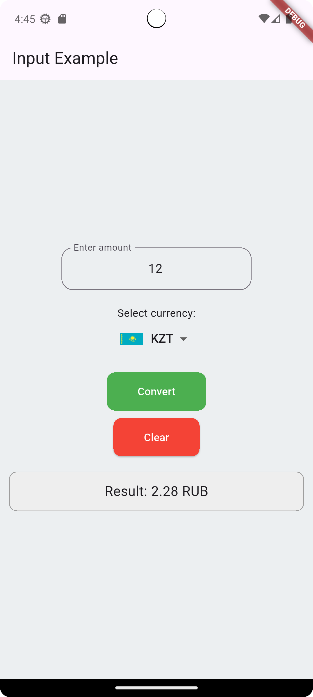

# 💱 Currency Converter (Flutter)

A simple Flutter app that converts currencies — USD, EUR, and KZT — into RUB.

## ✨ Features
- **Input validation** using `Form` and `TextFormField`
- **Smooth animations** with `AnimatedOpacity` and `AnimatedContainer`
- **Button state control** (disabled when input is invalid)
- **Country flag icons** loaded from local assets
- **Clean UI** built with `Material Design`

## 📸 Screenshots
| Home Screen | Result Screen |
|--------------|---------------|
|  |  |

## 🚀 How to Run
```bash
flutter pub get
flutter run
